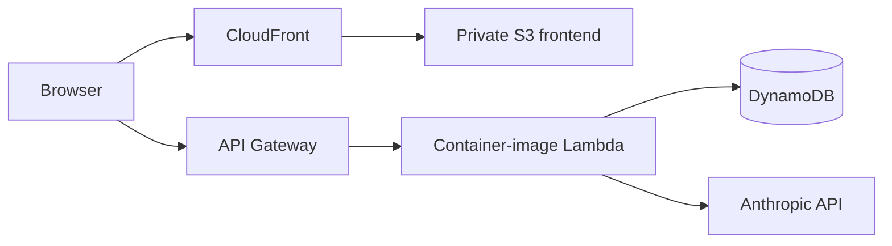

# PureZen

PureZen is a full-stack spa booking and operations application that began as an **AWS Academy capstone** and was later re-platformed twice: first to **Vercel + Hetzner**, and then back to AWS as a **serverless architecture**.

The project is useful as an infrastructure-modernization case study because the same application moved through three materially different hosting models: traditional AWS infrastructure, externally managed hosting, and finally AWS-managed serverless services.

> **Portfolio note:** the current repository primarily reflects the later application and serverless-AWS generations. The original AWS Academy environment included EC2 instances, load balancing, VPC networking, routing tables, IAM, and related infrastructure, but not all of that original environment is preserved as current IaC in this repository.

## Infrastructure evolution

### Generation 1 — AWS Academy capstone

PureZen was originally built and hosted inside the constrained AWS Academy environment using a more traditional infrastructure model:

- **EC2** for application compute
- **Load balancing**
- **VPC networking**
- **Routing tables**
- **IAM**
- other AWS resources available within the Academy environment

This version provided the first hands-on infrastructure implementation, but the Academy environment imposed resource and lifecycle limitations that made it a poor long-term home for the application.

### Generation 2 — Vercel + Hetzner

The application was then moved out of the Academy environment:

- the frontend used **Vercel-style hosting and routing**
- the FastAPI backend ran on a persistent **Hetzner** server
- the application still carried assumptions associated with always-on compute and a locally hosted Ollama runtime

The repository history preserves this generation through the later cleanup and migration commits that remove the obsolete Vercel/Hetzner paths.

### Generation 3 — AWS serverless re-platform

The application was ultimately brought back to AWS and redesigned around managed/serverless services:

- **AWS Lambda** using a container image for the FastAPI backend
- **API Gateway** in front of the API
- **DynamoDB** for application data
- private **S3** for static frontend hosting
- **CloudFront** for public delivery and TLS
- **AWS CDK v2 in TypeScript** for infrastructure definition
- managed Anthropic inference instead of a local Ollama runtime dependency

Commit [`5a29d28`](https://github.com/jetty-setter/purezen/commit/5a29d288ff1fbfb5694d244c93bc34118818c38a) added the Mangum adapter, converted the backend to an AWS Lambda container image, and removed the local Ollama dependency from the deployment path.

Commit [`5f759d2`](https://github.com/jetty-setter/purezen/commit/5f759d2c52cc748fd920672b30d4959ca5300f8a) introduced the TypeScript AWS CDK v2 stack for Lambda, API Gateway, DynamoDB permissions, and deployment configuration.

Commit [`db5fbb6`](https://github.com/jetty-setter/purezen/commit/db5fbb64053e81cba66202c7d48b5a5eabcd6cdb) moved the frontend to private S3 + CloudFront and removed the old backend origin from CORS.

Commit [`64b0d3b`](https://github.com/jetty-setter/purezen/commit/64b0d3b9f084fb5cdd5fdebd8f920c2c4c3d4349) removed obsolete Vercel/Hetzner deployment artifacts after the Lambda migration.

## Current architecture in the repository



### Backend

- **FastAPI** application exposed through API Gateway.
- **Mangum** adapts the ASGI application to Lambda.
- Backend is packaged as a **Lambda container image** using the AWS Python Lambda base image.
- Application data is stored in **DynamoDB**.

### Frontend

- Static HTML/CSS/JavaScript assets are deployed to a private **S3** bucket.
- **CloudFront** provides the public distribution and TLS termination.
- Origin Access Control keeps the S3 origin private.

### Infrastructure

- Defined in **AWS CDK v2 using TypeScript**.
- CDK owns the Lambda function, API Gateway, S3/CloudFront frontend, DynamoDB resources, IAM permissions, and stack outputs.
- Existing application tables are retained during modernization rather than destroyed and recreated.

## Engineering evidence

The fastest way to inspect the current implementation:

- [`cdk/lib/cdk-stack.ts`](cdk/lib/cdk-stack.ts) — TypeScript CDK stack defining Lambda, API Gateway, DynamoDB integration, S3, CloudFront, IAM, and deployment resources.
- [`Dockerfile`](Dockerfile) — packages the FastAPI backend as an AWS Lambda container image.
- [`app/main.py`](app/main.py) — FastAPI application plus the Mangum Lambda handler.
- [`app/llm.py`](app/llm.py) — managed Anthropic integration replacing the local Ollama runtime dependency.
- [`frontend/config.js`](frontend/config.js) — frontend API configuration targeting API Gateway.
- [`dynamodb-schema/`](dynamodb-schema/) — application data model and DynamoDB table definitions.

## Why the final architecture changed

The final rebuild reduced persistent-infrastructure ownership and made the application easier to reproduce and operate:

- **Lambda instead of persistent backend compute** removes the need to maintain an always-on application server.
- **API Gateway + Mangum** allowed the existing FastAPI application to move to serverless infrastructure without a full application rewrite.
- **Container-image Lambda** preserved control over Python dependencies while still using a managed runtime model.
- **S3 + CloudFront** replaced the prior Vercel/static-hosting path with AWS-managed delivery.
- **CDK** makes the AWS architecture reviewable and reproducible in code.
- **Managed LLM inference** removed the runtime dependency on a locally hosted Ollama model.

## Stack

**Cloud:** AWS Lambda · API Gateway · DynamoDB · S3 · CloudFront · IAM  
**Infrastructure as Code:** AWS CDK v2 · TypeScript  
**Backend:** Python · FastAPI · Mangum · Docker  
**Frontend:** HTML · CSS · JavaScript  
**AI:** Anthropic Claude  


## Portfolio demo data

The public admin console is read-only, but it still needs current appointment data to make the schedule, analytics, guest history, and AI operations assistant useful in a portfolio review.

`scripts/seed_demo_bookings.py` creates a synthetic portfolio dataset directly in `purezen_availability` without changing real availability or real bookings. By default it creates 30 days of recent history plus future appointments through March 31, 2027 using the existing staff/time schedule as a template.

Preview first:

```bash
python scripts/seed_demo_bookings.py
```

If the preview looks right, write the dataset:

```bash
python scripts/seed_demo_bookings.py --apply
```

Remove only the synthetic portfolio rows:

```bash
python scripts/seed_demo_bookings.py --reset
```

Every generated appointment is tagged with `demo_seed=true`, uses fictional `example.com` guest data and reserved 555 phone numbers, and can be regenerated later. If a different window is needed, `--future-days` can override the March 31, 2027 end date.
