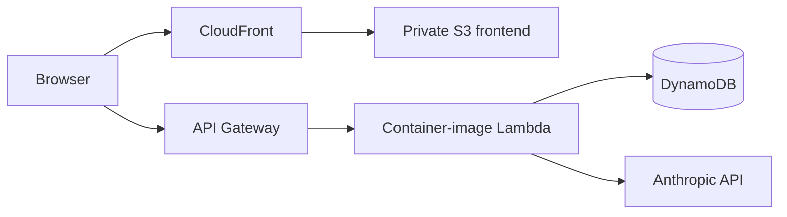

# PureZen

PureZen is a full-stack spa booking and operations application that I originally built as an AWS Academy capstone and later **re-platformed into a serverless AWS architecture**.

The interesting part of this repository is the modernization work: the application moved away from a server-hosted FastAPI backend, Vercel-style frontend routing, and local Ollama assumptions into a cloud-native deployment built around **AWS Lambda, API Gateway, DynamoDB, S3, CloudFront, Docker, and AWS CDK v2 in TypeScript**.

> **Portfolio note:** this repository is primarily an engineering case study. The code and commit history are the evidence for the architecture and migration described below; a live deployment is not required to review the work.

## Modernization story

The repository history captures the transition rather than only the finished state:

1. **Original application / AWS Academy roots**
   - The project began as an AWS Academy capstone and retained several local-model and server-hosting assumptions as it evolved.

2. **Server-hosted application**
   - Before the serverless rebuild, the FastAPI backend was deployed on a persistent server and the frontend used Vercel-style API routing.
   - The application also carried a local Ollama dependency that was unsuitable for the target serverless runtime.

3. **Lambda-ready application**
   - Commit [`5a29d28`](https://github.com/jetty-setter/purezen/commit/5a29d288ff1fbfb5694d244c93bc34118818c38a) added the Mangum adapter, converted the backend to an AWS Lambda container image, and removed the local Ollama runtime dependency from the deployment path.

4. **Infrastructure as Code**
   - Commit [`5f759d2`](https://github.com/jetty-setter/purezen/commit/5f759d2c52cc748fd920672b30d4959ca5300f8a) introduced a TypeScript AWS CDK v2 stack for the Lambda API, API Gateway, DynamoDB permissions, and deployment configuration.

5. **Static frontend modernization**
   - Commit [`db5fbb6`](https://github.com/jetty-setter/purezen/commit/db5fbb64053e81cba66202c7d48b5a5eabcd6cdb) moved the frontend to private S3 + CloudFront and removed the old backend origin from CORS.
   - Commit [`64b0d3b`](https://github.com/jetty-setter/purezen/commit/64b0d3b9f084fb5cdd5fdebd8f920c2c4c3d4349) removed obsolete Vercel/Hetzner deployment artifacts after the Lambda migration.

## Current architecture in the repository

### Backend

- **FastAPI** application exposed through API Gateway.
- **Mangum** adapts the ASGI application to Lambda.
- Backend is packaged as a **Lambda container image** using the AWS Python Lambda base image.
- Application data is stored in **DynamoDB**.

### Frontend

- Static HTML/CSS/JavaScript assets are deployed to a private **S3** bucket.
- **CloudFront** provides the public distribution and TLS termination.
- Origin Access Control keeps the S3 origin private.

### Infrastructure

- Defined in **AWS CDK v2 using TypeScript**.
- CDK owns the Lambda function, API Gateway, S3/CloudFront frontend, DynamoDB resources, IAM permissions, and stack outputs.
- Existing application tables are retained during modernization rather than destroyed and recreated.

## Engineering evidence

The fastest way to inspect the implementation:

- [`cdk/lib/cdk-stack.ts`](cdk/lib/cdk-stack.ts) — TypeScript CDK stack defining Lambda, API Gateway, DynamoDB integration, S3, CloudFront, IAM, and deployment resources.
- [`Dockerfile`](Dockerfile) — packages the FastAPI backend as an AWS Lambda container image.
- [`app/main.py`](app/main.py) — FastAPI application plus the Mangum Lambda handler.
- [`app/llm.py`](app/llm.py) — managed Anthropic integration replacing the local Ollama runtime dependency.
- [`frontend/config.js`](frontend/config.js) — frontend API configuration targeting API Gateway.
- [`dynamodb-schema/`](dynamodb-schema/) — application data model and DynamoDB table definitions.

## Why this architecture

The rebuild was intended to reduce infrastructure ownership and make the application easier to deploy and operate:

- **Lambda instead of a persistent application server** removes the need to maintain always-on backend compute.
- **API Gateway + Mangum** allowed the existing FastAPI application to move to serverless infrastructure without a full application rewrite.
- **Container-image Lambda** preserved control over Python dependencies while still using a managed runtime model.
- **S3 + CloudFront** replaced application-server/Vercel coupling for static frontend delivery.
- **CDK** makes the AWS architecture reviewable and reproducible in code.
- **Managed LLM inference** removed the runtime dependency on a locally hosted Ollama model.

## Stack

**Cloud:** AWS Lambda · API Gateway · DynamoDB · S3 · CloudFront · IAM  
**Infrastructure as Code:** AWS CDK v2 · TypeScript  
**Backend:** Python · FastAPI · Mangum · Docker  
**Frontend:** HTML · CSS · JavaScript  
**AI:** Anthropic Claude  
