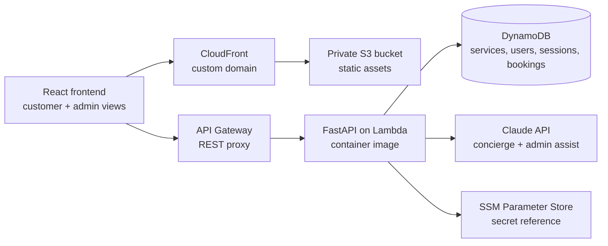

# PureZen

**AI-assisted spa and wellness booking platform deployed on AWS.**

PureZen is a full-stack portfolio build that turns a small wellness business into a cloud-backed booking experience. The customer-facing app uses a conversational concierge to answer service questions, guide booking intent, and collect appointment details, while the admin side exposes operational views for services, users, booking history, and demo management.

The point of the project is not just the chat UI. It is the architecture behind it: a containerized FastAPI API on AWS Lambda, DynamoDB-backed state, CloudFront-hosted frontend, CDK infrastructure, and a deliberately demo-safe deployment posture.

> **Live demo:** https://purezen.stephsimmons.dev  
> **Status:** deployed portfolio project; optimized for clarity, cost control, and supportability.

---

## What it demonstrates

- **Cloud-native application delivery** — frontend, API, database access, CDN, custom domain, and deployment infrastructure.
- **Serverless container pattern** — FastAPI runs as a Lambda container image through Mangum, avoiding always-on compute for a low-traffic demo.
- **Infrastructure as Code** — AWS CDK defines the API, Lambda, S3 frontend bucket, CloudFront distribution, certificate binding, and deploy outputs.
- **AI integration with guardrails** — Claude powers customer/admin language flows, but the booking path is still structured through deterministic state and validation.
- **Operational thinking** — demo mode, protected diagnostics, scoped CORS, configurable secrets, and documented production tradeoffs.

---

## Architecture



## Stack

| Layer | Choice |
|---|---|
| Frontend | React / TypeScript static app |
| API | FastAPI + Mangum running as a Lambda container image |
| Infrastructure | AWS CDK in TypeScript |
| Compute | AWS Lambda, API Gateway |
| Data | DynamoDB tables for services, chat/session state, users, and booking history |
| Hosting | S3 private bucket + CloudFront + custom domain |
| AI | Anthropic Claude, loaded server-side only |
| Security posture | Scoped CORS, read-only demo mode, protected diagnostics, SSM-ready secret handling, narrowed DynamoDB IAM actions |

---

## Why it is built this way

| Decision | Rationale |
|---|---|
| **FastAPI in a Lambda container** | Keeps the API familiar and testable locally while avoiding an always-on server for a demo-scale workload. |
| **API Gateway proxy integration** | Lets FastAPI own routing while AWS handles public ingress, TLS, throttling options, and Lambda invocation. |
| **DynamoDB** | Fits small, structured booking/service/session state without operating a relational database. |
| **S3 + CloudFront frontend** | Low-cost, CDN-backed static hosting with a private origin. |
| **CDK over click-ops** | Makes the deployment repeatable and reviewable. |
| **Claude behind the API** | Keeps the LLM key server-side and lets the app combine AI responses with deterministic booking state. |
| **Demo mode** | Allows a portfolio visitor to inspect the app without giving anonymous users write access to admin behavior. |

---

## Security and demo boundaries

This is a portfolio deployment, but it is structured to avoid the biggest demo-app red flags:

- The browser never receives the Anthropic API key.
- LLM diagnostics are disabled unless `DIAG_TOKEN` is configured and supplied in a matching request header.
- CORS is tied to the deployed frontend origin instead of being left globally open.
- DynamoDB IAM permissions are scoped to PureZen table prefixes and narrowed to the actions the API actually uses.
- The CDK stack supports retrieving the Anthropic key by SSM parameter name instead of baking a raw key into source or infrastructure code.
- `DEMO_MODE=true` is the default so public-facing admin behavior can stay read-oriented.

For a real production system, I would add a proper user pool, per-user authorization, write-audit trails, WAF/rate limits, structured app logs, and table-level access boundaries per feature area.

---

## Local setup

```bash
# API
python -m venv .venv
source .venv/bin/activate
pip install -r requirements.txt
export ANTHROPIC_API_KEY="sk-ant-..."
uvicorn app.main:app --reload

# Frontend
cd frontend
npm install
npm run dev
```

If deploying with SSM instead of a raw local environment variable:

```bash
aws ssm put-parameter \
  --name /purezen/prod/anthropic-api-key \
  --type SecureString \
  --value "sk-ant-..."

export ANTHROPIC_KEY_PARAM_NAME=/purezen/prod/anthropic-api-key
```

---

## Deploy

```bash
cd cdk
npm install
npx cdk synth
npx cdk deploy
```

Important deployment variables:

| Variable | Purpose |
|---|---|
| `SITE_DOMAIN` | Custom domain for the CloudFront distribution. Defaults to `purezen.stephsimmons.dev`. |
| `CERT_ARN` | ACM certificate ARN in `us-east-1` for CloudFront. |
| `ANTHROPIC_KEY_PARAM_NAME` | SSM SecureString parameter name for the Anthropic key. Defaults to `/purezen/prod/anthropic-api-key`. |
| `LLM_MODEL` | Claude model override. |
| `DEMO_MODE` | Keeps the public demo read-oriented by default. |
| `DIAG_TOKEN` | Enables the protected `/health/llm` diagnostic route only when explicitly configured. |

---

## What I would change at production scale

- Use Cognito or an external identity provider for customer/admin authentication.
- Split admin and public APIs or enforce route-level authorization with claims.
- Move from prefix-scoped DynamoDB permissions to table-specific grants created from CDK table constructs.
- Add CloudWatch dashboards, alarms, structured logs, and trace correlation IDs.
- Add WAF/rate limiting at the edge and API Gateway usage controls.
- Use Secrets Manager rotation or a dedicated secret-management workflow for LLM credentials.
- Add CI gates for linting, tests, CDK synth, and dependency vulnerability scanning.

---

## Repo layout

```text
app/        FastAPI application, chat orchestration, admin/user/service routes
frontend/   Static customer/admin UI
cdk/        AWS CDK stack for Lambda, API Gateway, S3, CloudFront, and deployment outputs
```

---

## Portfolio context

PureZen is one of several AWS builds in my portfolio. It sits beside event-driven and data-heavy projects to show a different side of cloud engineering: customer-facing app delivery, AI-assisted workflows, IaC, and operationally aware demo deployment.
